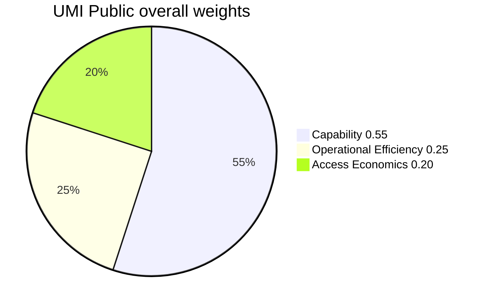
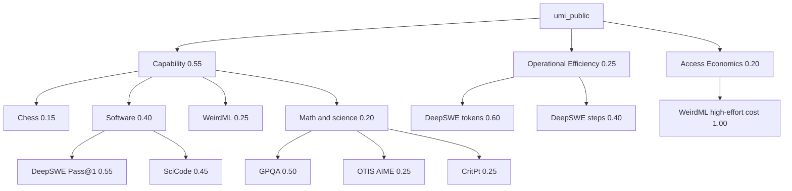
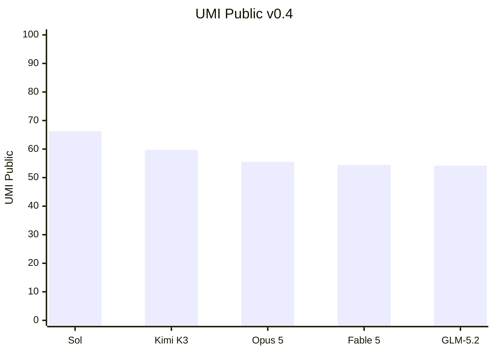

# UMI pilot report

## UMI Public v0.5 Governed

**Governed expansion of the frozen v0.4 Public score.** Edition `umi-public-v0.5`, formula
`umi-methodology-v0.5.0`. The five Max pilots reproduce v0.4 exactly. Two additional
high-effort systems have the complete ten-series common core and are scored as themselves,
not as Max. Rebuild:

```bash
PYTHONPATH=. uv run --no-sync umi edition --edition v0.5 validate
PYTHONPATH=. uv run --no-sync umi edition --edition v0.5 score
PYTHONPATH=. uv run --no-sync umi edition --edition v0.5 audit
PYTHONPATH=. uv run --no-sync umi edition --edition v0.5 candidates
```

| Rank | Configuration | Effort | UMI Public | Partial 95% interval | Rank range |
|---:|---|---|---:|---|---|
| 1 | GPT-5.6 Sol Max | max | 66.27 | 65.46–66.91 | 1–1 |
| 2 | Kimi K3 Max | max | 59.69 | 58.15–60.89 | 2–2 |
| 3 | GPT-5.4 (2026-03-05) | xhigh | 55.51 | 54.42–56.39 | 3–7 |
| 4 | Claude Opus 5 Max | max | 55.51 | 54.21–56.39 | 3–7 |
| 5 | Gemini 3.6 Flash | high | 55.44 | 53.86–56.86 | 3–7 |
| 6 | Claude Fable 5 Max | max | 54.43 | 53.00–55.59 | 3–7 |
| 7 | GLM-5.2 Max | max | 54.20 | 52.00–55.82 | 3–7 |

Intervals are `partial_source_interval`: published stderr / CI half-width on chess, GPQA,
OTIS, DeepSWE Pass@1, and WeirdML accuracy. SciCode, CritPt, DeepSWE tokens/steps, and
WeirdML cost stay at their point values. Sol and Kimi are rank-stable. Places 3–7 overlap.

Charts: [v0.5 dashboard](data/editions/v0.5/processed/public-dashboard.html). Validation:
[validation.json](data/editions/v0.5/processed/validation.json). Uncertainty:
[uncertainty.json](data/editions/v0.5/processed/uncertainty.json). Certificate:
[public-index-certificate.json](data/editions/v0.5/processed/public-index-certificate.json).
The certificate binds those scores to the Epoch zip SHA-256 and marks overlapping intervals
as indistinguishable.

Four other `_max` rows (Terra, Luna, Sonnet 5, Opus 4.8) miss only WeirdML and are not
scored. v0.4 artifacts remain frozen.

Grok 4.5 High and Gemini 3.1 Pro Preview were audited against the same ten-series gate.
Neither is headline-eligible. Diagnostic certificates are
[candidate-audits.json](data/editions/v0.5/processed/candidate-audits.json).
`umi_public` is null on both.

| Candidate | Config IDs | Present | Missing | Status |
|---|---|---:|---|---|
| Grok 4.5 High | `grok-4.5_high` | 8/10 | WeirdML accuracy and high-effort cost | `insufficient_common_support` |
| Gemini 3.1 Pro Preview | `gemini-3.1-pro-preview`, `_high` | 9/10 | high-effort WeirdML cost (unsuffixed cost 1.36 is excluded by the Access suffix panel) | `insufficient_common_support` |

## UMI Public v0.4

**Historical experimental point-score edition.** It proved five exact Max identities can
share one complete common core and yield deterministic `umi_public` numbers. It does not
prove rank stability, independent zip validation, or coverage beyond those five systems.
v0.5 is the governed public index. Edition `umi-public-v0.4`, formula
`umi-methodology-v0.4.0`, normalization `umi-normalization-v0.4.0`. Publication state
`published`. Fingerprint `e266af13b966cf79cfc5086513ec35f60cf2194f896f41f4b332f60ac9788e6d`.
Authority: [METHODOLOGY.md](METHODOLOGY.md). Rebuild offline, no API keys:

```bash
PYTHONPATH=. uv run --no-sync umi edition --edition v0.4 score
PYTHONPATH=. uv run --no-sync umi edition --edition v0.4 dashboard
```

This is not v0.3 `headline_overall` and not provider-billed Economics.

### Methods

The scored entity is the exact Max deployment, not the marketing family. Claude Fable 5 Max
is a `fallback_composite_service` with documented Opus 4.8 fallback. SciCode and CritPt rows
that name that fallback score the composite product. Exact `_max` product-label rows also
score it. Unknown effort cannot map to Max.

Every headline series must contain all five exact entity IDs and an 8+ same-extract anchor
panel. A domain with no such series is omitted from the edition, not zero-filled. Required
common-core coverage is 1.0. Maximum independent-lab share is 0.35 when a component has two
or more originating organizations.

Each series is scored once against its frozen Epoch extract. Proportions use a logit with
ε = 1e-3. Lower-better resources and costs use `-log(x+1)`. Robust-z uses the panel median
and MAD, winsorized to ±3, then mapped through Φ to a 0–100 point. There is no percentile
fallback. Display-row order does not change a score. Non-finite source values are rejected.
Access Economics uses the WeirdML cost extract restricted to high-effort IDs ending in
`_max`, `_xhigh`, `_high`, or `_promax` so cheap historical completions cannot collapse the
scale. DeepSWE rows are restricted to `mini-swe-agent`.

```text
umi_public = 0.55 × Capability
           + 0.25 × Operational Efficiency
           + 0.20 × Access Economics
```

| Layer | Allocation | Why |
|---|---:|---|
| Capability | 0.55 | Primary construct |
| Operational Efficiency | 0.25 | Success-relevant resource intensity and steps |
| Access Economics | 0.20 | Source-reported public task cost, not a bill |

| Capability domain | Weight | Families |
|---|---:|---|
| General reasoning and knowledge | 0.15 | Epoch chess puzzles 1.00 |
| Software engineering | 0.40 | DeepSWE v1.1 Pass@1 0.55; AA SciCode 0.45 |
| Agentic and tool-mediated work | 0.25 | WeirdML accuracy 1.00 |
| Mathematics and science | 0.20 | GPQA Diamond 0.50; OTIS Mock AIME 0.25; CritPt 0.25 |

Software is 0.40 because it is the only Capability domain with two originating organizations
and a same-harness 50-config panel. General plus math/science sum to 0.35 so Epoch stays at
the source-share cap. Operational Efficiency is DeepSWE output tokens 0.60 and agent steps
0.40. Access Economics is WeirdML cost per run 1.00.

Omitted from this edition: context reliability, language/instruction following, interactive
latency, fixed tariff baskets, and DeepSWE cost (Fable official coverage is 432/436). AA and
Cursor five-row extracts fail the 8+ panel gate. Intervals are unpublished: the extracts are
configuration-level means without attempt residuals.





### Published ranking

| Rank | Configuration | Kind | Capability | Op. Efficiency | Access Economics | Weighted Cap | Weighted Eff | Weighted Acc | UMI Public |
|---:|---|---|---:|---:|---:|---:|---:|---:|---:|
| 1 | GPT-5.6 Sol Max | single_model_service | 91.944801 | 49.662825 | 16.402460 | 50.569641 | 12.415706 | 3.280492 | 66.265839 |
| 2 | Kimi K3 Max | open_weight_deployment | 88.839676 | 27.796768 | 19.398245 | 48.861822 | 6.949192 | 3.879649 | 59.690663 |
| 3 | Claude Opus 5 Max | single_model_service | 90.731355 | 19.259083 | 3.965025 | 49.902245 | 4.814771 | 0.793005 | 55.510021 |
| 4 | Claude Fable 5 Max | fallback_composite_service | 88.710888 | 21.989913 | 0.705849 | 48.790988 | 5.497478 | 0.141170 | 54.429636 |
| 5 | GLM-5.2 Max | open_weight_deployment | 67.885646 | 23.217369 | 55.306275 | 37.337106 | 5.804342 | 11.061255 | 54.202703 |

Sol leads because Capability is high and DeepSWE tokens/steps are much lower than the
Anthropic and Kimi Max rows. GLM is last on Capability but cheapest on Access, which is
why it finishes within a point of Fable. Fable's Access score is the expensive tail of
the high-effort WeirdML cost panel.



### Capability series matrix

0–100 robust-z scores from the frozen common core. These are the Capability inputs, not
`umi_public`.

| Configuration | Chess | DeepSWE | SciCode | WeirdML | GPQA | OTIS AIME | CritPt |
|---|---:|---:|---:|---:|---:|---:|---:|
| GPT-5.6 Sol Max | 96.1 | 84.0 | 89.8 | 99.9 | 89.0 | 99.8 | 80.6 |
| Kimi K3 Max | 85.2 | 77.4 | 94.0 | 99.8 | 88.1 | 90.3 | 76.6 |
| Claude Opus 5 Max | 88.2 | 85.4 | 88.9 | 99.9 | 90.0 | 96.0 | 79.3 |
| Claude Fable 5 Max | 87.2 | 79.4 | 95.8 | 99.9 | 70.3 | 99.2 | 79.1 |
| GLM-5.2 Max | 52.7 | 31.4 | 74.0 | 96.4 | 84.9 | 68.0 | 75.2 |

GLM’s Capability gap is DeepSWE and chess, not GPQA. Fable’s GPQA cell is the weakest
frontier-lab science score in the five-set.

### Charts

The committed dashboard already draws the four views. Charts read published JSON only.
They do not recompute scores, render a null as zero, or label Access as billed cost.
Do not plot 95% intervals until attempt-level residuals exist.

| Artifact | What it contains |
|---|---|
| [public-dashboard.html](data/editions/v0.4/processed/public-dashboard.html) | SVG: UMI Public bars, stacked weighted contributions, grouped unweighted components, Capability heatmap |
| [public-dashboard.json](data/editions/v0.4/processed/public-dashboard.json) | Chart contract with weights, limitations, and rounded series |
| [public-ranking.csv](data/editions/v0.4/processed/public-ranking.csv) | Rank, components, and weighted contributions |
| [public-series.csv](data/editions/v0.4/processed/public-series.csv) | Long series table: raw + 0–100 score per model |
| [model-scores.json](data/editions/v0.4/processed/model-scores.json) | Canonical scored payload |

## v0.3 publication decision

**Legacy product: a governed Capability ranking of Opus, Kimi, and GLM. No headline UMI
Overall score and no universal rank.**

The five configurations remain visible as model-specific partial estimates. None is eligible for
`headline_overall`. Opus, Sol, Kimi, and GLM clear the Capability-only coverage and breadth gates;
Fable does not. Efficiency is 4.5% DeepSWE-only coverage and Economics is empty, so Overall stays
null. Paid benchmark execution is out of scope for this publication: completing the frozen
MMLU-Pro contract would fill at most the 10% general-interaction family and still could not clear
the 0.50 / 0.40 component gates.

The first ranking we will stand behind is the existing three-model common-evidence comparison and
[certificate](data/pilots/v0.3/processed/comparison-certificate-three-model.json) for Claude Opus 5
Max, Kimi K3 Max, and GLM-5.2 Max. It is a Capability ranking on eleven shared series. It is not
Overall, not Efficiency, and not Economics.

## Scored raw evidence

| Configuration | HLE | AA-LCR | AA-Omniscience | ARC-AGI-2 | DeepSWE v1.1 (95% CI) | CursorBench 3.2 | AA Terminal-Bench 2.1 | GDPval-AA v2 Elo (95% CI) | τ³-Banking | GPQA | SciCode | CritPt | Partial Capability | Partial Efficiency | Headline |
|---|---:|---:|---:|---:|---:|---:|---:|---:|---:|---:|---:|---:|---:|---:|---:|
| Claude Opus 5 Max | 54.87% | 75.67% | 37.07 | 90.42% | 73.65% (69.78–77.52) | 70.0% | 89.14% | 1848.77 (1826.40–1871.14) | 42.06% | 93.88% | 55.67% | 29.14% | 78.29 | 41.67 | null |
| Claude Fable 5 Max | rejected: fallback | rejected: fallback | rejected: fallback | missing | 69.72% (65.69–73.76) | rejected: fallback unverified | rejected: fallback | rejected: fallback | rejected: fallback | rejected | rejected | rejected | 50.00 | 50.00 | null |
| GPT-5.6 Sol Max | 49.49% | 77.67% | 21.97 | 92.50% | 72.67% (69.84–75.50) | 67.2% | 88.01% | 1725.18 (1708.82–1741.53) | 44.33% | 93.50% | 56.13% | 32.30% | 73.69 | 100.00 | null |
| Kimi K3 Max | 46.90% | 82.67% | 19.70 | 60.42% | 68.51% (63.98–73.05) | 60.8% | 85.02% | 1682.29 (1662.55–1702.04) | 45.98% | 93.12% | 58.68% | 23.40% | 39.48 | 58.33 | null |
| GLM-5.2 Max | 41.15% | 76.67% | 4.43 | rejected: unknown effort | 43.78% (42.05–45.50) | 55.0% | 77.90% | 1506.11 (1491.09–1521.12) | 34.64% | 91.86% | 50.46% | 20.86% | 1.93 | 0.00 | null |

Partial Capability is cohort-relative. Opus, Sol, and Kimi cover 100% across twelve families and
five domains. GLM covers 86.25% across eleven families and five domains; Fable covers only DeepSWE
at 8.25%. Those model-specific partials are not directly rankable across
evidence profiles and are not Overall scores. Fable is also release-window-ineligible because its
2026-06-09 release predates the 2026-06-15 start.

## Stable-panel normalized contributions

The five-model common comparison uses DeepSWE as its single common raw metric. Its secondary
percentile scale is fitted once to Fable, Opus, GLM, Sol, and Kimi, then reused for every display
subset. The three-model Opus/Kimi/GLM comparison uses HLE, DeepSWE, CursorBench, GDPval-AA v2,
Terminal-Bench, τ³-Banking, AA-LCR, AA-Omniscience, GPQA, SciCode, and CritPt; DeepSWE
still uses the five-model panel and GPQA still uses its four accepted models. For example, Kimi's
DeepSWE stable-panel percentile remains 25 whether Sol is displayed or omitted.

Every processed comparison exposes the panel members and IDs, requested `robust_z` strategy,
applied small-cohort percentile fallback, raw contributions, absolute configured weights, composite
score, evidence-profile ID, and score-scale ID. These percentile positions are relative ranks on a
declared panel, not capability-distance measurements.

## Rank sensitivity

The five-model DeepSWE comparison exhaustively evaluates 32 joint endpoint scenarios from five
source-declared intervals. Its central order is Opus, Sol, Fable, Kimi, GLM. The first four can each
occupy ranks 1–4 under the endpoint scenarios, while GLM remains rank 5; each of the first four
robustly dominates GLM. The result does not claim probabilities.

The three-model comparison exhaustively evaluates 512 scenarios from three GDPval-AA source
intervals, three DeepSWE source intervals, and three GPQA standard-error approximations. Opus is
rank 1 centrally, Kimi rank 2, and GLM rank 3. Those ranks remain fixed in all 512 endpoint
scenarios: Opus robustly dominates Kimi and GLM, and Kimi robustly dominates GLM. GPQA intervals are explicitly labeled as
normal approximations using `1.96 × SE`, not source-published confidence intervals.

When a requested group has no ready compatible common series, `umi compare` returns a structured
`insufficient_common_support` abstention with no scores or ranks. Missing support and incompatible
cohorts remain visible; malformed inputs and unknown model IDs still fail.

## Comparison validity and certificate

The retained Opus/Kimi/GLM certificate is `provisional_comparison`, not a headline ranking. All
three configurations share the same eleven canonical benchmark series, evidence-profile ID, eleven
bundle-wide stable normalization panels, and weighted-composite score-scale ID. The certificate
also binds 33 selected benchmark records to nine frozen source-artifact checksums and retains
the 512-scenario rank envelopes. Those bindings—not similar labels—are why its values are directly
comparable. Provisional small-panel normalization and incomplete Capability breadth remain explicit
warnings and prevent the certificate from becoming a universal UMI score.

## Diagnostic evidence

- Artificial Analysis Intelligence values are composite references. The Fable value is rejected
  because its label includes an Opus 4.8 fallback deployment.
- Artificial Analysis HLE v4.1 scores are independent atomic measurements for Opus, Sol, Kimi, and
  GLM on the documented 2,158-question text-only, pass@1 cohort. The facts-only extract retains the
  exact published rates and access date without inventing a run date. Fable is rejected because its
  public HLE label explicitly routes through Opus 4.8 fallback.
- Artificial Analysis GDPval-AA v2 Elo scores are independent task measurements for Opus, Sol,
  Kimi, and GLM on one 220-task public-work-product cohort, with published 95% intervals. Fable is
  rejected because its row explicitly uses Opus 4.8 fallback. Average turns, token summaries, and
  calculated cost components remain diagnostic because Elo is not a binary success denominator and
  the published cost combines provider token counts with live typical cache-hit measurements.
- Artificial Analysis τ³-Banking scores are independent pass@1 measurements for Opus, Sol, Kimi,
  and GLM across 97 tasks repeated five times. Fable is rejected because its row explicitly uses
  Opus fallback. Incomplete operational summaries, calculated rather than billed cost, and
  conflicting public decode-time units remain diagnostic and contribute neither Efficiency nor
  Economics.
- Artificial Analysis AA-LCR scores are independent pass@1 measurements for Opus, Sol, Kimi, and
  GLM across 100 hard long-context questions repeated three times on v4.1.1. Fable is rejected
  because its row explicitly uses fallback. Answer/reasoning token and operational timing/cost
  summaries remain diagnostic because accounting is nonstandard and incomplete and calculated cost
  is not a verified billing ledger.
- Artificial Analysis AA-Omniscience contributes its published reliability Index once for exact
  Opus, Sol, Kimi, and GLM Max rows on 6,000 open-answer questions. Fable's fallback-qualified row
  is rejected. Accuracy, attempt rate, hallucination rate, answer decomposition, token totals,
  calculated costs, and upstream time are reconciled but diagnostic; they do not become extra
  scoring votes or Efficiency/Economics evidence.
- Artificial Analysis Terminal-Bench v2.1 contributes exact pass@1 results for Opus, Sol, Kimi,
  and GLM on 89 tasks repeated three times with Terminus 2 in E2B. Fable's fallback-qualified row
  is rejected. Provider-specific aggregate token counters remain diagnostic and do not become
  cross-provider Efficiency or Economics evidence.
- CursorBench 3.2 solution-correctness scores are independent atomic measurements for Opus, Sol,
  Kimi, and GLM on the current ambiguous multi-file task cohort. Fable is rejected because Cursor
  documents invisible Fable-to-Opus routing and the run does not prove fallback absence. The table's
  cost/task, tokens/task, and steps/task values are retained but excluded from Efficiency and
  Economics without a compatible success denominator and verified deployment identity.
- Epoch ECI input rows are retained as diagnostic references because their source matrix combines
  heterogeneous harnesses/settings and ECI selects highest results across settings.
- Epoch's raw GPQA archive supplies four scoring-ready exact Max rows. Fable is rejected because the
  CSV does not prove fallback routing was absent and the linked run log was access-controlled.
- The same frozen Epoch archive supplies creator-run SciCode and CritPt results for four exact Max
  configurations. Their execution dates are not established, so UMI keeps `evaluation_date` null
  and uses the frozen measurement-as-of date for freshness. Fable's rows explicitly include Opus
  4.8 fallback and are rejected.
- ARC Prize verified-leaderboard ARC-AGI-2 rows score for Opus, Sol, and Kimi on the semi-private
  120-task pass@2 cohort. One duplicate Opus source ID whose display label says High is rejected,
  as is GLM's unknown-effort row. Published task cost is retained as metadata, not Economics.
- Arena Agent and text/style-control ratings are diagnostic preference evidence. The Agent artifact
  has exact labels and efforts but no immutable snapshot/deployment identity; missing or non-Max
  effort labels are rejected.
- DeepSWE is explicitly classified as autonomous task under operational profile
  `deepswe-v1.1-mini-swe-agent-autonomous` and success definition
  `deepswe-v1.1-trial-passed`. Its arithmetic-mean input/output tokens and agent steps enter
  provisional Efficiency after
  per-record success adjustment. The official 27,558-row ledger reconciles 2,231 scored attempts for
  the five Max configurations and binds every retained mean to its actual observation count. Cached
  tokens, wall duration, and dollar cost remain diagnostic because exact deployment identity is not
  verified; Fable cost is additionally incomplete at 432 observations for 436 scored attempts, and
  the runner derives dollars from LiteLLM pricing rather than a disclosed endpoint-, tier-,
  pricing-revision-, and billing-record-bound task ledger.
- Official token tariffs are now retained for all five configurations, including cached-input rates
  and published cache-write, long-context, and tool-fee terms. They cannot establish cost per task
  until compatible task-level token, tool, and success observations exist.
- Four numeric GPT-5.6 Sol Max release claims are retained as vendor claims. None is silently matched
  to a differently dated or differently harnessed independent result.

## Why no headline exists

- Opus, Sol, Kimi, and GLM now clear the Capability-only 0.60 coverage and three-domain breadth
  gates; Fable remains below both coverage and breadth;
- Efficiency coverage is 0.045, below 0.50, and Economics coverage is zero, below 0.40;
- ready resources cover only DeepSWE in one of three configured coding families and three of eight metrics;
- missing workload evidence is not reweighted to make the cohort eligible.

The generated [model-specific partial estimates](data/pilots/v0.3/processed/model-specific-partial-estimates.json)
have no model-specific Overall rank and null `headline_overall` for every model. The five-model
[common-evidence comparison](data/pilots/v0.3/processed/common-evidence-five-model-comparison.json)
uses DeepSWE only because Fable's other benchmark identities are not cleared; that panel cannot be
the first official ranking. The exact three-model
[common-evidence comparison](data/pilots/v0.3/processed/common-evidence-three-model-comparison.json)
uses all eleven scored series under the current strict identity policy and is the first official
**Capability** ranking product. Both lead with raw values and carry stable-panel and score-scale
identity. The
[three-model comparison certificate](data/pilots/v0.3/processed/comparison-certificate-three-model.json)
adds the governed bundle, source-record, artifact-checksum, identity, and deterministic result
fingerprint proof. It must not be restyled as a headline UMI Overall score. The
[source-bound uncertainty report](data/pilots/v0.3/processed/source-bound-uncertainty.json)
re-scores one published bound at a time; it is not probabilistic propagation. The
[source readiness report](data/pilots/v0.3/processed/source-readiness.json),
[overlap report](data/pilots/v0.3/processed/overlap.json), and
[pilot sensitivity report](data/pilots/v0.3/processed/pilot-sensitivity.json) are machine-readable.
The [pilot gap report](data/pilots/v0.3/processed/pilot-gap-report.json) enumerates every configured
benchmark/model cell and every workload-category gate.

## Sensitivity result

Equal-family and source-ablation scenarios are computed without relaxing publication gates. Removing
a source does not redistribute or enlarge its domain budget. Every scenario continues to have a null
headline. These scenarios expose how dependent the scored benchmark families are on the pilot's
nine frozen scored source artifacts.

## Reproducibility

The pilot build is deterministic and offline. It records exact source revisions, checksums, adapter
versions, accepted records, diagnostics, and rejected rows. The complete audit fingerprint changes
when diagnostic/rejected evidence changes; the scored fingerprint does not.
